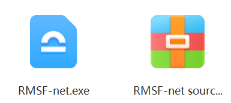
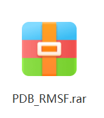

## Accurate Prediction of Protein Structural Flexibility by Deep Learning Integrating Intricate Atomic Structures and Cryo-EM Density Information

Here is an official implementation for RMSF-net. (The current code is a temporary version which will be added more complete features in the future.)

This script is mainly for CPU version, which can be adapted to general computing devices while maintaining a relatively fast processing speed.

### System requirements
- Ubuntu 18.04 (recommend, any compatible system is OK.)
<!-- - CUDA Toolkit version: 11.3 (if use GPUs, any compatibility version is ok) -->


<!-- simply editing will be suitable for GPU support. -->

### Install

1. Downlaod and install UCSF Chimera from  https://www.cgl.ucsf.edu/chimera/download.html, and set environment variable "CHIMERA_PATH" as the path to chimera exeutable file, e.g., "path_to_chimera/bin/chimera".

2. Install Anaconda or Miniconda.

3. Run ./install.sh, to create a python environment called rmsf-net. 

Typical installation time is expected to be less than 30 minutes.


### Usage
For flexibility prediction, execute command:
```
conda activate rmsf-net
python predict.py -p pdb_file -e emd_file -o output_dir  -m mode 

```

- pdb_file: The path to PDB file in .pdb format.
- emd_file: The path to cryo-EM map in .map or .mrc format.
- output_dir: The path to save the middle data file generated by the program and the final prediction output.
- mode: The mode selected by the user, which can be 1, 2, or 3, corresponding to the three options "Only PDB model","Only PDB model","Cryo-EM plus PDB model"


We recommened to run this script for your protein of interest with its corresponding cryo-EM map (2-4 Å) and PDB file on mode 3, which is the main method in our work.

Example:
```
python predict.py -p "data/6FBV.pdb" -e "data/emd_4230.map" -o "results" -m 3 
```

If you can not set chimera environment variable , you can also specify the chimera exeutable path at the command line, as following: 

```
python predict.py -p "data/6FBV.pdb" -e "data/emd_4230.map" -o "results" -m 3 -ch "path_to_chimera/bin/chimera"
```

Typical prediction on CPUs will cost less than 3 minutes.


### Output
Run the command line above, the program will generate PDB simulated map (sim_map.mrc) and data file (data.pth) and save to "./results" directory. 

The predicted RMSF will be normalized and mapped onto the bfactor column of the original PDB file, saved to  "./results" directory according to the mode, e.g. "/results/pdb_plus_cryoem/rmsf_nor.pdb" for mode 3.

You can visualize the RMSF output using the output pdb file at UCSF Chimera or PyMOL.


### Web-Fronted RMSF-net software

<!-- The web-based RMSF-net with user-friendly interface can be downloaded from  "https://pan.baidu.com/s/18MLxSjfn404-6TIGR5ECvQ" with extraction code "rmsf", as follows:
<div style="text-align:center">
  
</div>
including:

1. RMSF-net.exe, an installation file on Windows System. Run this file, and RMSF-net will be installed as a software.

2. RMSF-net source code (web-based version). Source code of the web-based RMSF-net. This repository is its backend part.  -->
The web-fronted RMSF-net with user-friendly interface can be downloaded from Figshare (https://doi.org/10.6084/m9.figshare.25893670).

**The detailed description of this software and its interface are provided in the section "Accessible and user-friendly RMSF-net" of the paper's Supplementary Material.**

### RMSF annotated pdb files

<!-- <div style="text-align:center">
  
</div> -->

The datasets containing MD simulation annotations for RMSF-net training and evaluation are accessible for download
from Figshare (https://doi.org/10.6084/m9.figshare.25893670).


